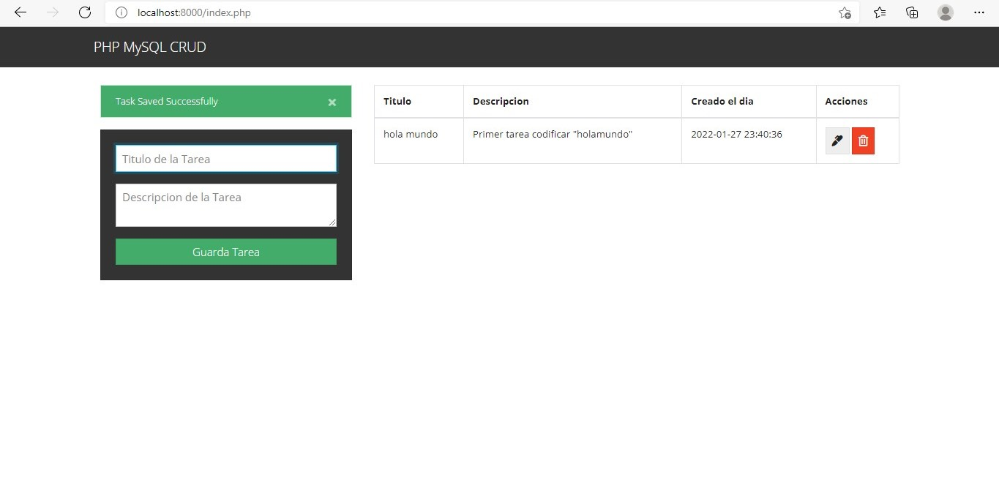

# Screenshot

###FUNCIONAMIENTO

- La Aplicacion movil esta realizada en PHP utilizando el Modelo ,Vista, Controlador y con su DB en SQL
- Es una Aplicacion estilo To do List donde realizamos las funciones basicas de Create , Update , Delete

